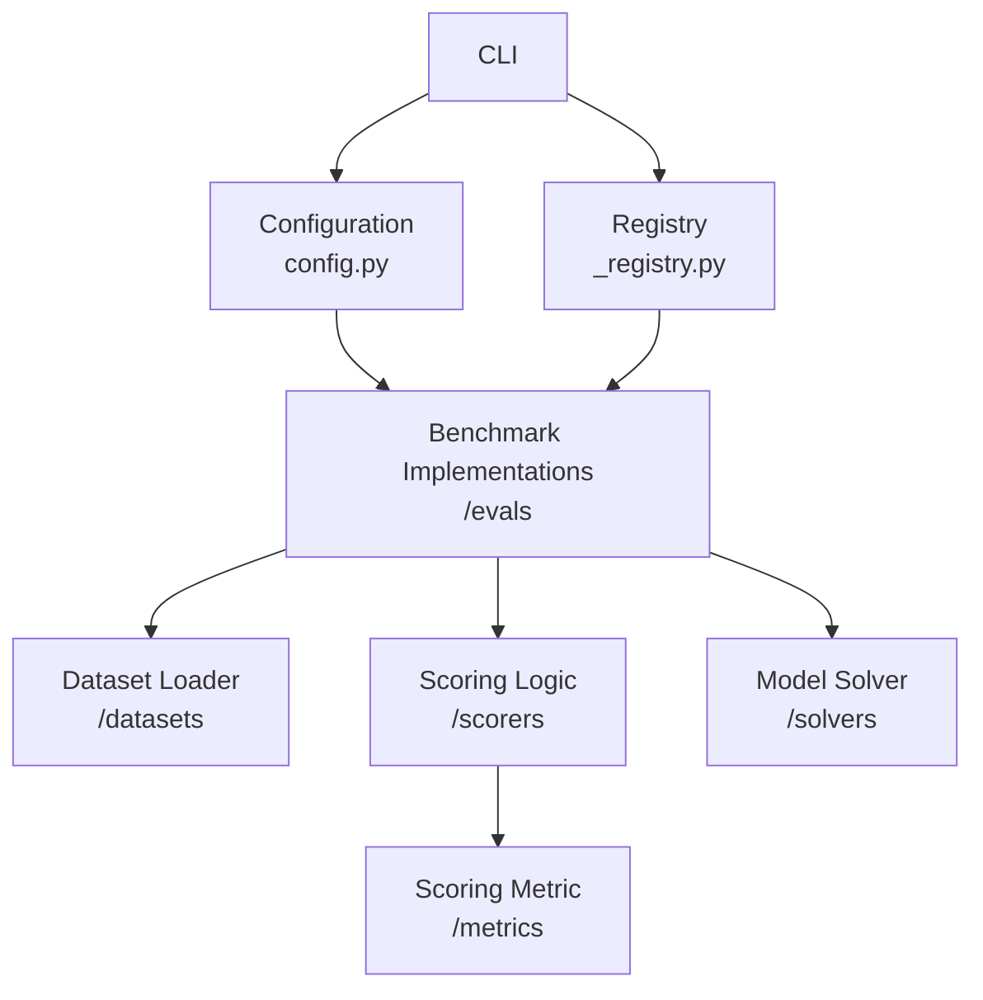

## Overview

OpenBench is built on top of [Inspect AI](https://github.com/UKGovernmentBEIS/inspect_ai), providing a unified interface for evaluating language models across multiple benchmarks and providers.

## System Architecture



## Core Components

### 1. Task Registry (`_registry.py`)

The registry dynamically discovers and loads benchmark tasks:

```python _registry.py
# Contains model provider registation e.g.
@modelapi(name="cerebras")
def cerebras() -> Type[ModelAPI]:
    from .model._providers.cerebras import CerebrasAPI
    return CerebrasAPI
...

# And task registration e.g.
from .evals.simpleqa import simpleqa  # noqa: F401, E402
...
```

<Note>
Custom evaluations must be added to the registry to be discoverable by OpenBench.
</Note>

### 2. Benchmark Metadata (`config.py`)

Lightweight configuration for benchmarks:

```python
class BenchmarkMetadata:
    name: str  # Human-readable display name
    description: str  # Human-written description
    category: str  # Category for grouping
    tags: List[str]  # Tags for searchability

    # Registry info
    module_path: str
    function_name: str

    # Alpha/experimental flag
    is_alpha: bool = False  # Whether this benchmark is experimental/alpha
```

```python config.py
"simpleqa": BenchmarkMetadata(
    name="SimpleQA",
    description="Measuring short-form factuality in large language models with simple Q&A pairs",
    category="core",
    tags=["factuality", "question-answering", "graded"],
    module_path="openbench.evals.simpleqa",
    function_name="simpleqa",
)
```

### 3. Evaluation Task Implementations (`evals/`)

Each benchmark follows a standard pattern:

```python
@task
def benchmark_task():
    return Task(
        # Basic components
        dataset=load_dataset(),     # Data loading and preprocessing
        solver=solver_method,       # How the model processes questions
        scorer=create_scorer(),     # Evaluating answers
        name="eval_name",           # Evaluation display name
    )
```

```python evals/simpleqa.py
@task
def simpleqa(grader_model: str = "openai/gpt-4.1-2025-04-14") -> Task:
    return Task(
        dataset=get_dataset(),
        solver=[generate()],
        scorer=simpleqa_scorer(model=grader_model),
        name="simpleqa",

        # Advanced
        config=GenerateConfig(
            temperature=0.0,  # Use deterministic generation for factual QA
        ),
    )
```

<Tip>Reference InspectAI: [Task](https://inspect.aisi.org.uk/tasks.html), [GenerateConfig](https://inspect.aisi.org.uk/reference/inspect_ai.model.html#generateconfig)</Tip>

### 3. Dataset Loaders (`datasets/`)

Standardized data loading:

```python
def record_to_sample(record) -> Sample:
    # Separate preprocessing logic for complex dataset parsing

def load_dataset() -> Dataset:
    # 1. Download/load raw data
    # 2. Parse records into Sample objects (or call record_to_sample)
    # 3. Return Dataset
```

```python datasets/simpleqa.py
def record_to_sample(record: dict) -> Sample:
    """Convert a SimpleQA CSV record to an Inspect Sample."""
    return Sample(
        input=record["problem"],
        target=record["answer"],
        metadata={"metadata": record.get("metadata", "")},
    )


def get_dataset() -> Dataset:
    # Load the SimpleQA dataset
    dataset = csv_dataset(
        csv_file="https://openaipublic.blob.core.windows.net/simple-evals/simple_qa_test_set.csv",
        sample_fields=record_to_sample,
        auto_id=True,
        name="simpleqa",
    )

    # Convert to list of samples
    samples = list(dataset)

    return MemoryDataset(samples=samples, name="simpleqa")
```

<Tip>Reference InspectAI: [Sample](https://inspect.aisi.org.uk/reference/inspect_ai.dataset.html#sample), [Dataset](https://inspect.aisi.org.uk/datasets.html)</Tip>

### 4. Scoring System (`scorers/`)

Custom scoring and metric mechanisms can be defined:

```python
@scorer
def benchmark_scorer() -> Callable:
    async def score(state, target) -> Score:
        # Extract model answer
        # Compare with target
        return Score(
            value=score,
            answer=extracted_answer,
            metadata={}
        )
    return score
```

```python expandable
@scorer(metrics=[accuracy(), stderr()])
def simpleqa_scorer(model: str) -> Callable:
    """SimpleQA is a model-graded benchmark. Predicted and target answers are evaluated by a grader model."""

    grader_model: Model = get_model(model)

    async def score(state: TaskState, target: Target) -> Score:
        question = state.input_text
        predicted_answer = state.output.completion

        # Format the grader model prompt
        grader_prompt = GRADER_TEMPLATE.format(     
            question=question, target=target.text, predicted_answer=predicted_answer
        )

        # Get grading response
        message = ChatMessageUser(content=grader_prompt)
        grading_response = await grader_model.generate([message])
        grading_text = grading_response.completion

        # Regex extraction of grade
        match = re.search(r"(A|B|C)", grading_text)
        grade_letter = match.group(0) if match else "C"  # Default to NOT_ATTEMPTED
        grade_map = {"A": ("correct", 1.0), "B": ("incorrect", 0.0), "C": ("not_attempted", 0.0),}
        grade_name, score_value = grade_map.get(grade_letter, ("not_attempted", 0.0))

        # Return score with metadata
        return Score(
            value=score_value,
            answer=predicted_answer,
            metadata={
                "grade": grade_name,
                "grade_letter": grade_letter,
                "grading_response": grading_text,
            },
        )

    return score
```

<Tip> Reference InspectAI: [Scorer](https://inspect.aisi.org.uk/reference/inspect_ai.scorer.html#scorer), [Score](https://inspect.aisi.org.uk/reference/inspect_ai.scorer.html#score) </Tip>
Scoring Archetypes:

- **Exact match**: Direct comparison
- **Pattern match**: Regex-based
- **Model-graded**: Use secondary grader model to score
- **Symbolic**: Mathematical equivalence
- **Custom**: Task-specific logic

### 5. Scoring Metrics (`metrics/`)
Metrics provide aggregate insight on model performance across all samples: 
```python
@metric
def benchmark_metrics() -> Metric:
    def metric_calculator(list[SampleScore]) -> Value:
        # Custom metrics, breakdown by category, etc.
        return {
            "metric": value
            ...
        }
    return metric_calculator
```

```python expandable
@metric
def simpleqa_metrics() -> Metric:
    """Calculate SimpleQA specific metrics: F1 and accuracy_given_attempted."""

    def metric_calculator(scores: list[SampleScore]) -> Value:

        # Counts of each grade type 
        grade_counts = {"correct": 0, "incorrect": 0, "not_attempted": 0}
        for sample_score in scores:
            metadata = sample_score.score.metadata
            grade = metadata.get("grade", "").lower() if metadata else ""
            if grade in grade_counts:
                grade_counts[grade] += 1

        # Convert to percentages
        total = len(scores)
        is_correct = grade_counts["correct"] / total
        is_incorrect = grade_counts["incorrect"] / total
        is_not_attempted = grade_counts["not_attempted"] / total
        is_given_attempted = is_correct + is_incorrect

        # Calculate accuracy given attempted
        accuracy_given_attempted = (
            is_correct / is_given_attempted if is_given_attempted > 0 else 0.0
        )

        # Calculate F1
        f1 = (2 * accuracy_given_attempted * is_correct / (accuracy_given_attempted + is_correct)
            if (accuracy_given_attempted + is_correct) > 0 else 0.0
        )

        return {
            "is_correct": is_correct,
            "is_incorrect": is_incorrect,
            "is_not_attempted": is_not_attempted,
            "is_given_attempted": is_given_attempted,
            "accuracy_given_attempted": accuracy_given_attempted,
            "f1": f1,
        }

    return metric_calculator
```
Include custom metrics in the scorer function decorator for automatic detection during evaluation.

```python
@scorer(metrics=[accuracy(), stderr(), simpleqa_metrics()])
def simpleqa_scorer(model: str):
    ...
```

<Tip> Inspect AI builds in support for common metrics inluding accuracy and stderr. Learn more about [built-in metrics.](https://inspect.aisi.org.uk/reference/inspect_ai.scorer.html#metrics)  
Reference InspectAI: [Metric](https://inspect.aisi.org.uk/reference/inspect_ai.scorer.html#metric) </Tip>

### 6. Model Solver Logic (`solvers/`)

Solvers define how the evaluated model processes questions.
OpenBench supports custom solver logic, though InspectAI provides a number of robust [built-in solvers](https://inspect.aisi.org.uk/solvers.html#built-in-solvers).

```python
Task(
    dataset=dataset,
    solver=generate(),  # Most commonly used solver
    scorer=scorer,
)
```

```python
# Chain together built-in solver components
solver = [
    system_message("You are a helpful assistant"),
    prompt_template("{question}"),
    generate(),           # Get model response
    extract_answer(),     # Parse response
    validate_format()     # Ensure correct format
]
```

<Tip>Reference InspectAI: [Solvers](https://inspect.aisi.org.uk/solvers.html)</Tip>

## File Structure

```
openbench/
├── src/openbench/
│   ├── _cli/           # CLI commands
│   │   ├── list.py
│   │   ├── describe.py
│   │   ├── eval.py
│   │   └── view.py
│   ├── datasets/       # Data loaders
│   │   ├── mmlu.py
│   │   ├── humaneval.py
│   │   └── ...
│   ├── evals/          # Benchmark tasks
│   │   ├── mmlu.py
│   │   ├── humaneval.py
│   │   └── ...
│   ├── metrics/        # Custom metrics
│   │   ├── mmlu.py
│   │   ├── humaneval.py
│   │   └── ...
│   ├── scorers/        # Scoring functions
│   │   ├── choice.py
│   │   ├── pattern.py
│   │   └── ...
│   ├── utils/          # Utilities
│   ├── _registry.py    # Task registry
│   └── config.py       # Configuration
├── tests/             # Test suite
├── pyproject.toml     # Package config
└── README.md
```

## Extension Points - Adding New Benchmarks

1. Eval task in `evals/`
2. Dataset loader in `datasets/`
3. Scoring logic in `scorers/`
3. Custom solver in `solvers/` (optional)
4. Custom metric in `metrics/` (optional)
5. Benchmark metadata in `config.py`
6. Import eval task into `_registry.py`
